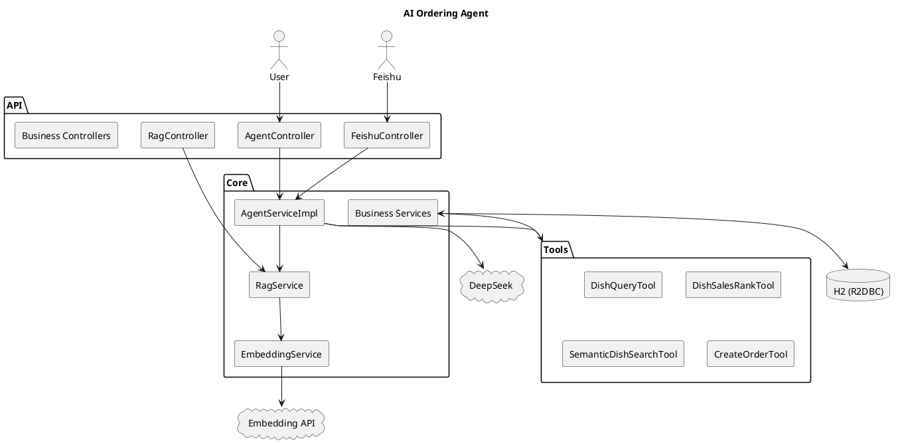

# 技术架构说明

> 用户向入门请读 [README.md](./README.md)；本文为开发者架构与 API 参考。

---

## 1. 系统概览

智能点餐后端采用**全链路响应式**栈：WebFlux 接入层、R2DBC 持久化、Reactor 组合异步调用；IO 密集的大模型与 Embedding 请求通过 OkHttp 在 `Mono.fromCallable` 中执行，避免阻塞 EventLoop。

```text
Client / 飞书 / 前端
        │
        ▼
  REST Controllers (WebFlux)
        │
        ├── AgentService ──► DeepSeek Chat API
        │       ├── Tools (查菜/销量榜/语义检索/下单)
        │       └── RagService ──► EmbeddingService ──► bge-m3 / 方舟 / 本地向量
        ├── AiOrderingService ──► DeepSeek
        ├── Dish / Order / Category Services
        └── OperationLogWebFilter
        │
        ▼
  R2DBC Repositories ──► H2 (内存)
```

---

## 2. 技术栈

| 层级 | 选型 | 说明 |
|------|------|------|
| 运行时 | Java 21 | LTS |
| 框架 | Spring Boot 3.2.5 | WebFlux + Validation |
| 数据库 | H2 + R2DBC | 演示用内存库；`schema.sql` 初始化 |
| 对话 LLM | DeepSeek | `/chat/completions` |
| 向量 | VikingDB bge-m3 / 火山方舟 | `/api/data/embedding/version/2` 或 `/embeddings` |
| HTTP | OkHttp 4.12 | LLM、Embedding、飞书 |
| 前端 | React 19 + Vite 8 | 见 [frontend/README.md](./frontend/README.md) |
| Agent 辅助 | Cursor Skills | `.cursor/skills/ai-ordering-dev` |

---

## 3. 模块职责

### 3.1 Controller

| 类 | 路径前缀 | 职责 |
|----|----------|------|
| `AgentController` | `/api/agent` | 多轮对话、会话管理 |
| `RagController` | `/api/rag` | 向量检索、reindex、状态 |
| `FeishuController` | `/api/feishu` | 飞书事件 Webhook（条件装配） |
| `AiOrderingController` | `/api/ai` | 单次 LLM 解析/推荐 |
| `DishController` / `OrderController` / `CategoryController` | `/api/*` | 业务 CRUD |
| `OperationLogController` | `/api/logs` | 日志查询 |

### 3.2 Agent 与工具

- **`AgentServiceImpl`**：组装 Prompt（含 RAG 上下文）、调用 DeepSeek、解析 `<function>` 工具调用、执行工具、二次总结；含模拟模式与下单兜底。
- **工具**（实现 `Tool` 接口）：

| 工具名 | 类 |
|--------|-----|
| `query_dishes` | `DishQueryTool` |
| `query_dishes_sales_rank` | `DishSalesRankTool` |
| `semantic_search_dishes` | `SemanticDishSearchTool` |
| `query_orders` | `OrderQueryTool` |
| `query_categories` | `CategoryQueryTool` |
| `create_order` | `CreateOrderTool` |

**`DishSalesRankTool`（`query_dishes_sales_rank`）**

- 数据源：`DishRepository.findTopSales(limit)`，`WHERE is_available = true ORDER BY sales_count DESC`
- 参数：`limit`（可选，默认 10，上限 20）
- 与 REST `GET /api/dishes/top-sales` 同源查询逻辑（REST 固定 Top 10，经 `DishService.getTopSales()`）
- 模拟模式：`AgentServiceImpl.containsSalesRankIntent` 识别「销量 / 畅销 / 卖得最好 / 排行榜」等关键词

工具调用格式：

```text
<function name="create_order" params='{"items":[{"name":"麻婆豆腐","quantity":3}]}'>
<function name="query_dishes_sales_rank" params='{"limit":5}'>
```

### 3.3 RAG 与向量

| 类 | 职责 |
|----|------|
| `EmbeddingService` | 按 `ai.embedding.provider` 选择客户端 |
| `DoubaoBgeM3EmbeddingClient` | VikingDB embedding v2，`model_name=bge-m3`，1024 维 |
| `DoubaoArkEmbeddingClient` | 火山方舟 OpenAI 兼容 `/embeddings` |
| `VectorStoreService` | `dish_embedding` 持久化 + 内存余弦检索 |
| `DishVectorIndexService` | 菜品全文索引、增量更新 |
| `RagService` | 检索、格式化 Agent 上下文 |

数据流：

```text
dish 行 → 拼接索引文本 → embed → dish_embedding 表 + 内存 Map
用户 query → embed → Top-K cosine → 注入 Prompt / 工具返回
```

### 3.4 飞书

| 类 | 职责 |
|----|------|
| `FeishuController` | 接收 POST webhook |
| `FeishuEventService` | 解密、校验、解析 `im.message.receive_v1`、异步调 Agent |
| `FeishuClient` | `tenant_access_token` 缓存、回复消息 |
| `FeishuCrypto` | 事件加解密 |

会话 ID：`feishu:{chat_id}`，与 Web `sessionId` 隔离。

### 3.5 基础设施

- **`OperationLogWebFilter`**：记录 `/api/**` 请求，响应头 `X-Trace-Id`
- **`DataInitializer`**：示例分类与菜品，完成后 `reindex` 向量
- **`R2dbcConfig`**：执行 `schema.sql`（含 `dish_embedding`）

---

## 4. 架构图（PlantUML）



---

## 5. 配置说明

密钥仅通过**环境变量**或 **`application-local.yml`**（gitignore）注入，见 [README.md#配置参考](./README.md)。

| 前缀 | 用途 |
|------|------|
| `ai.deepseek.*` | Agent / AiOrdering 对话 |
| `ai.embedding.*` | RAG 向量化（provider: `doubao-bge-m3` \| `doubao-ark` \| `openai`） |
| `rag.*` | 开关、top-k、min-score、是否注入 Prompt |
| `feishu.*` | 飞书机器人 |
| `agent.ordering.*` | 模拟模式、记忆条数、Prompt |

---

## 6. API 端点汇总

### Agent

| 方法 | 路径 |
|------|------|
| POST | `/api/agent/chat` |
| GET | `/api/agent/session/{id}/messages` |
| GET | `/api/agent/session/{id}/summary` |
| DELETE | `/api/agent/session/{id}` |

### RAG

| 方法 | 路径 |
|------|------|
| GET | `/api/rag/search?q=` |
| GET | `/api/rag/search/text?q=` |
| GET | `/api/rag/status` |
| POST | `/api/rag/reindex` |

### 飞书

| 方法 | 路径 |
|------|------|
| POST | `/api/feishu/webhook` |

### AI（非会话）

| 方法 | 路径 |
|------|------|
| POST | `/api/ai/order/parse` |
| POST | `/api/ai/order` |
| GET | `/api/ai/recommend` |

### 业务

| 资源 | 基础路径 |
|------|----------|
| 菜品 | `/api/dishes` |
| 菜品销量榜 | `GET /api/dishes/top-sales` |
| 菜品评分榜 | `GET /api/dishes/top-rated` |
| 订单 | `/api/orders` |
| 分类 | `/api/categories` |
| 日志 | `/api/logs` |

---

## 7. 数据模型（核心表）

| 表 | 说明 |
|----|------|
| `dish` | 菜品 |
| `orders` | 订单（items 为 JSON CLOB） |
| `chat_history` | Agent 多轮消息 |
| `dish_embedding` | 菜品向量（`embedding_json`） |
| `operation_log` | 请求与 AI 调用日志 |

---

## 8. Cursor Skills

项目 Skill 位于 `.cursor/skills/`：

- **`ai-ordering-dev`**：本地启动、密钥、RAG/Agent/飞书调试、新增 Tool 步骤

详见 [.cursor/skills/README.md](./.cursor/skills/README.md)。

---

## 9. 扩展建议

| 方向 | 建议 |
|------|------|
| 数据库 | H2 → PostgreSQL + pgvector 或外接 Milvus |
| 密钥 | 环境变量 / Vault；禁止明文进 Git |
| LLM | 流式 SSE 返回；重试与限流 |
| 飞书 | 卡片消息、群 @ 解析 |
| 测试 | Agent 工具契约测试、RAG 召回集成测试 |

---

## 10. 相关文档

- [README.md](./README.md) — 快速开始与配置
- [AI_ORDERING_DISCUSSION_SUMMARY.md](./AI_ORDERING_DISCUSSION_SUMMARY.md) — 历史讨论
- [frontend/README.md](./frontend/README.md) — 前端
