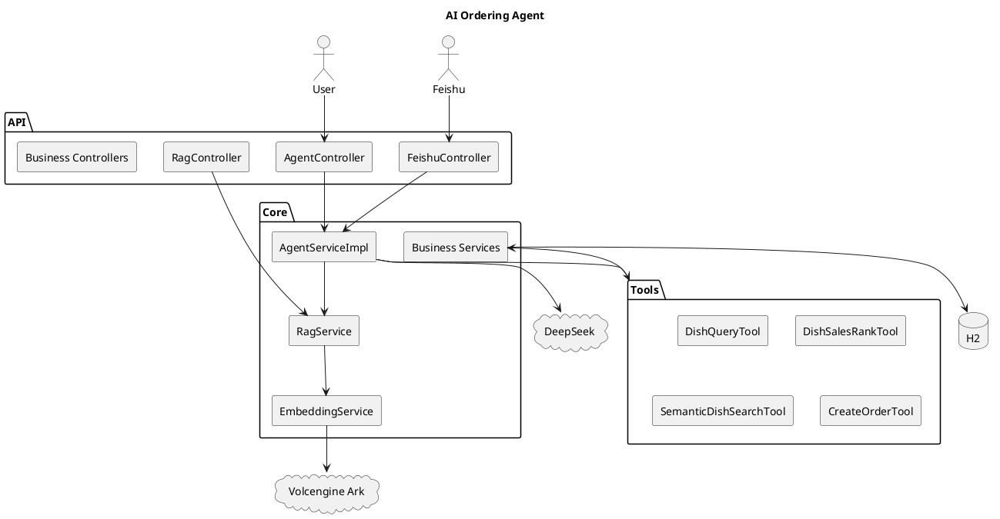

# 技术架构说明

> 入门与配置：[README.md](./README.md)  
> 本文：模块划分、RAG/Agent 调用链、API 与数据模型。

---

## 1. 系统概览

后端为**全链路响应式**：WebFlux 接入、R2DBC 访问 H2、Reactor 编排；DeepSeek / 方舟 Embedding / 飞书等外部 IO 在 `Mono.fromCallable` + OkHttp 中执行，避免阻塞 Netty EventLoop。

```text
Client / 飞书 / frontend
        │
        ▼
  REST Controllers (WebFlux)
        │
        ├── AgentServiceImpl ──► DeepSeek /v1/chat/completions
        │       ├── 6× Tool
        │       └── RagService ──► EmbeddingService ──► Ark
        │                              ├── /embeddings
        │                              └── /embeddings/multimodal
        ├── AiOrderingService ──► DeepSeek
        ├── Dish / Order / Category Services
        └── OperationLogWebFilter (X-Trace-Id)
        │
        ▼
  R2DBC ──► H2 内存库 (schema.sql)
```

---

## 2. 技术栈

| 层级 | 选型 | 说明 |
|------|------|------|
| 运行时 | Java 21 | LTS |
| 框架 | Spring Boot 3.2.5 | WebFlux、Validation、`@ConfigurationProperties` |
| 数据库 | H2 + R2DBC | 演示；`R2dbcConfig` 执行 `schema.sql` |
| 对话 | DeepSeek | OpenAI 兼容 Chat API |
| 向量 | 火山方舟 Ark | `ep-xxx` 接入点；支持 multimodal |
| HTTP 客户端 | OkHttp 4.12 | LLM、Embedding、飞书 |
| 前端 | React 19 + Vite 8 | [frontend/README.md](./frontend/README.md) |
| 开发辅助 | Cursor Skills | `.cursor/skills/ai-ordering-dev` |

---

## 3. 模块职责

### 3.1 Controller 层

| 类 | 前缀 | 职责 |
|----|------|------|
| `AgentController` | `/api/agent` | 多轮对话、会话 CRUD |
| `RagController` | `/api/rag` | 检索、reindex、status |
| `FeishuController` | `/api/feishu` | Webhook（`@ConditionalOnProperty`） |
| `AiOrderingController` | `/api/ai` | 单次 LLM 解析/下单/推荐 |
| `DishController` | `/api/dishes` | 菜品 CRUD、top-sales、top-rated |
| `OrderController` | `/api/orders` | 订单 |
| `CategoryController` | `/api/categories` | 分类 |
| `OperationLogController` | `/api/logs` | 日志查询、统计 |

### 3.2 Agent 与工具

**`AgentServiceImpl`** 主流程：

1. 加载 `chat_history`（最近 N 条）  
2. `RagService.buildAgentContext` 注入 RAG 块（可关）  
3. 调用 DeepSeek；解析 `<function name="..." params='...'>`  
4. 执行 `Tool`，将结果写回 Prompt 再总结（或 `summarizeToolResults` 兜底）  
5. 持久化 assistant 消息  

| 工具名 | 实现类 |
|--------|--------|
| `query_dishes` | `DishQueryTool` |
| `query_dishes_sales_rank` | `DishSalesRankTool` |
| `semantic_search_dishes` | `SemanticDishSearchTool` |
| `query_orders` | `OrderQueryTool` |
| `query_categories` | `CategoryQueryTool` |
| `create_order` | `CreateOrderTool` |

**模拟模式**（`agent.ordering.simulation-mode=true`）：无有效 DeepSeek Key 时，按关键词触发工具（含销量、辣味、下单意图）。

工具调用示例：

```text
<function name="semantic_search_dishes" params='{"query":"辣的下饭"}'>
<function name="query_dishes_sales_rank" params='{"limit":5}'>
<function name="create_order" params='{"items":[{"name":"麻婆豆腐","quantity":3}]}'>
```

### 3.3 RAG 与向量库

**存储**：`dish_embedding` 表 + `VectorStoreService` 内存索引；检索为**全量余弦**（适合演示规模，非 ANN）。

| 类 | 职责 |
|----|------|
| `EmbeddingService` | 固定 `doubao-ark`；`embed()` + 可选 `localEmbed` 兜底 |
| `DoubaoArkEmbeddingClient` | `multimodal=false` → `/embeddings`；`true` → `/embeddings/multimodal`（文本 `{type:text}`） |
| `DishVectorIndexService` | `buildIndexText` → embed → upsert；`reindexAll` |
| `VectorStoreService` | delete+insert upsert、`reloadFromDatabase`、`similaritySearch` |
| `RagService` | `retrieve`、`formatSearchResult`、`buildAgentContext` |

**索引文本格式**（`VectorStoreService.buildContentText`）：

```text
菜名:宫保鸡丁
分类:中式菜肴
描述:经典川菜...
价格:38.00元
```

**`DishEmbedding`** 实现 `Persistable<Long>`，配合 upsert 时 delete 后 insert，避免 R2DBC 误 UPDATE。

**`GET /api/rag/status` 字段**：`enabled`、`indexedCount`、`embeddingProvider`、`embeddingEndpoint`、`embeddingConfigured`、`embeddingMultimodal`、`vectorStore`。

### 3.4 飞书集成

| 类 | 职责 |
|----|------|
| `FeishuController` | POST `/webhook` |
| `FeishuEventService` | 校验 token、解密、解析 `im.message.receive_v1` |
| `FeishuClient` | 获取 `tenant_access_token`、回复消息 |
| `FeishuCrypto` | 可选事件加解密 |

会话隔离：`sessionId = feishu:{chat_id}`，复用 `AgentService.chat()`。

### 3.5 基础设施

| 组件 | 说明 |
|------|------|
| `DataInitializer` | 示例分类/菜品 → `dishVectorIndexService.reindexAll()` |
| `OperationLogWebFilter` | 记录 `/api/**`，写 `operation_log` |
| `GlobalExceptionHandler` | 统一 `ApiResponse` 错误体 |
| `DishServiceImpl` | 菜品变更后 `indexDish` 增量更新向量 |

---

## 4. Agent + RAG 时序（概念）

```text
User → POST /api/agent/chat
  → load history
  → RagService.buildAgentContext(query)     [可选]
  → DeepSeek(system + tools + history + RAG)
  → parse <function> …
  → Tool.execute (e.g. SemanticDishSearchTool → RagService)
  → DeepSeek 总结 or summarizeToolResults
  → save chat_history
```

---

## 5. 架构图（PlantUML）



---

## 6. 配置说明

密钥通过**环境变量**或 **`application-local.yml`**（gitignore）注入。

| 前缀 | 用途 |
|------|------|
| `ai.deepseek.*` | Agent / AiOrdering |
| `ai.embedding.*` | `provider=doubao-ark`、`api-key`、`model`(ep)、`multimodal`、`fallback-local` |
| `rag.*` | `enabled`、`top-k`、`min-score`、`inject-to-agent-prompt` |
| `feishu.*` | 机器人开关与凭证 |
| `agent.ordering.*` | `simulation-mode`、`memory.max-history-messages` |

---

## 7. API 端点汇总

### Agent — `/api/agent`

| 方法 | 路径 |
|------|------|
| POST | `/chat` |
| GET | `/session/{id}/messages` |
| GET | `/session/{id}/summary` |
| DELETE | `/session/{id}` |

### RAG — `/api/rag`

| 方法 | 路径 |
|------|------|
| GET | `/search?q=` |
| GET | `/search/text?q=` |
| GET | `/status` |
| POST | `/reindex` |

### 飞书 — `/api/feishu`

| 方法 | 路径 |
|------|------|
| POST | `/webhook` |

### AI（非会话）— `/api/ai`

| 方法 | 路径 |
|------|------|
| POST | `/order/parse` |
| POST | `/order` |
| GET | `/recommend` |

### 业务

| 资源 | 路径 |
|------|------|
| 菜品 | `/api/dishes`，`/top-sales`，`/top-rated` |
| 订单 | `/api/orders` |
| 分类 | `/api/categories` |
| 日志 | `/api/logs`，`/logs/stats`，`/logs/trace/{traceId}` |

---

## 8. 数据模型（核心表）

| 表 | 说明 |
|----|------|
| `category` | 分类 |
| `dish` | 菜品（含 `sales_count`、`rating`） |
| `orders` | 订单，`items` 为 JSON CLOB |
| `order_item` | 订单明细（结构保留） |
| `chat_history` | Agent 多轮消息 |
| `dish_embedding` | 向量：`dish_id` PK、`embedding_json`、`dimension` |
| `operation_log` | 请求日志 |

---

## 9. Cursor Skills

`.cursor/skills/ai-ordering-dev`：本地启动、方舟 multimodal 配置、RAG/Agent curl、新增 Tool 步骤。

---

## 10. 扩展建议

| 方向 | 建议 |
|------|------|
| 向量库 | H2+内存 → PostgreSQL pgvector / Milvus；ANN 索引 |
| Embedding | 图片 URL 入 multimodal input；批量 embed |
| LLM | SSE 流式输出；重试与限流 |
| 飞书 | 卡片消息、富文本 |
| 测试 | Ark 集成测试（`@EnabledIfEnvironmentVariable`）；工具契约测试 |

---

## 11. 相关文档

- [README.md](./README.md)
- [AI_ORDERING_DISCUSSION_SUMMARY.md](./AI_ORDERING_DISCUSSION_SUMMARY.md)
- [frontend/README.md](./frontend/README.md)
