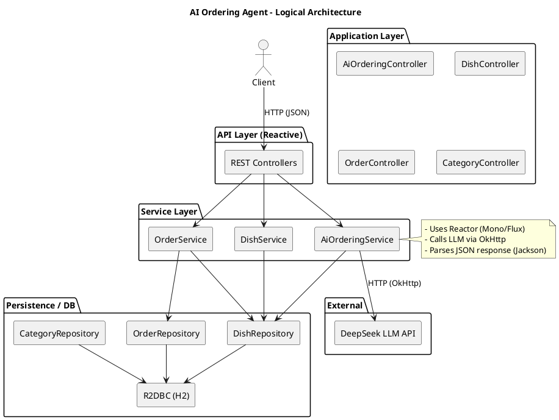

# AI Ordering Agent — 技术分析与架构

- [ ] 读取并分析项目关键文件（pom.xml、Application、配置、主要 controller/service/entity）
- [ ] 总结技术栈与外部依赖
- [ ] 绘制技术架构图（PlantUML + ASCII 备选）
- [ ] 生成 README 目录（README.md 的目录结构建议）
- [x] 将分析与图表写入文件（本文件）

---

## 一、项目概览（简要）

该项目名为 `ai-ordering-agent`，是一个基于 Spring Boot（响应式 WebFlux）的智能点餐后端示例，包含：

- REST API（Reactive WebFlux）
- 响应式持久化（Spring Data R2DBC + H2 内存数据库）
- AI 能力通过外部 LLM 服务（DeepSeek）实现，使用 OkHttp 调用 HTTP API
- Reactor（Flux/Mono）贯穿业务逻辑
- 模块化结构：controller -> service -> repository -> entity / dto
- DataInitializer 在启动时创建表并注入示例数据


## 二、技术栈

- 平台与语言：Java 21
- 构建工具：Maven
- 框架：Spring Boot 3.2.5
  - spring-boot-starter-webflux（响应式 Web）
  - spring-boot-starter-data-r2dbc（响应式 DB）
  - spring-boot-starter-validation（校验）
- 数据库：H2（内存），r2dbc-h2 驱动
- HTTP 客户端：OkHttp（用于调用 DeepSeek）
- JSON：Jackson (jackson-databind)
- 反应式库：Project Reactor（Flux/Mono）
- Lombok（可选、源码中以手写 Builder 形式存在）
- 其他：Reactor Test、Spring Boot Test（测试依赖）

配置与运行：
- `application.yml` 包含 AI 服务配置（ai.deepseek.api-key、base-url、model）以及 R2DBC URL（r2dbc:h2:mem:///orderdb）和 H2 控制台路径 (/h2-console)


## 三、关键模块与责任

- Controller 层
  - `AiOrderingController`：AI 解析点餐、基于 AI 创建订单、获取推荐
  - `DishController`：菜品 CRUD / 列表 / 搜索 / 排行查询
  - `CategoryController`：分类查询
  - `OrderController`：订单创建/查询/修改/取消

- Service 层
  - `AiOrderingServiceImpl`：负责与 DeepSeek（外部 LLM）通信，解析自然语言为结构化订单，返回推荐文本
  - `DishServiceImpl`：菜品领域逻辑（转换、校验、top-sales/top-rated）
  - `OrderServiceImpl`：订单业务逻辑（计算金额、生成 orderNo、持久化并更新销量）

- Repository 层（响应式）
  - `DishRepository`、`CategoryRepository`、`OrderRepository`：基于 `ReactiveCrudRepository`，并包含自定义 SQL 查询（@Query）

- 配置/初始化
  - `R2dbcConfig`：使用 ConnectionFactoryInitializer 加载 `schema.sql`
  - `DataInitializer`：程序启动时使用 DatabaseClient 创建表并注入示例数据


## 四、系统运行/调用流程（高层说明）

1. 客户端（Web/移动/外部）发起 HTTP 请求到本服务（例如 POST /api/ai/order/parse）
2. Controller 接收请求并调用对应 Service（返回 Mono/Flux）
3. `AiOrderingServiceImpl` 使用 OkHttp 调用 DeepSeek API（基于 application.yml 的配置），获取自然语言解析结果
4. 将 LLM 返回的菜品名称映射到本地菜品（DishRepository.findByIsAvailableTrue）并组装 OrderRequest
5. `OrderServiceImpl` 校验菜品、计算金额、生成订单号并通过 OrderRepository 保存
6. 数据写入 H2（R2DBC），并在必要时更新 Dish 的 sales_count


## 五、架构图

以下提供 PlantUML 格式（可直接在支持 PlantUML 的渲染器中渲染），同时给出 ASCII 备选图。

PlantUML（复制到 PlantUML 渲染器或 VS Code PlantUML 插件）：



ASCII 备选图：

Client --> REST Controllers (WebFlux)
REST Controllers --> Services (AiOrdering / Dish / Order)
AiOrderingService --> DeepSeek LLM (OkHttp)
Services --> Repositories (R2DBC)
Repositories --> H2 (r2dbc-h2)


## 六、关键配置点（摘录）

- server.port: 8080
- spring.r2dbc.url: r2dbc:h2:mem:///orderdb
- H2 console: /h2-console
- AI 配置：
  - ai.deepseek.api-key
  - ai.deepseek.base-url
  - ai.deepseek.model


## 七、README 建议目录（README.md 目录）

1. 项目简介
2. 快速开始
   - 环境要求（Java 21、Maven）
   - 本地运行（mvn spring-boot:run）
   - 配置（如何替换 ai.deepseek.api-key / base-url）
3. 架构概览
   - 技术栈
   - 架构图（PlantUML / ASCII）
4. API 文档（主要端点）
   - AI 相关
     - POST /api/ai/order/parse
     - POST /api/ai/order
     - GET /api/ai/recommend
   - 菜品
     - GET /api/dishes
     - GET /api/dishes/{id}
     - POST /api/dishes
     - PUT /api/dishes/{id}
     - DELETE /api/dishes/{id}
   - 分类
     - GET /api/categories
   - 订单
     - POST /api/orders
     - GET /api/orders/{id}
     - GET /api/orders/no/{orderNo}
     - GET /api/orders/user/{userId}
     - PUT /api/orders/{id}/status
     - DELETE /api/orders/{id}
5. 数据模型（entity & DTO 简述）
6. 数据库与迁移
   - R2DBC + H2（内存）
   - schema.sql 与 DataInitializer
7. AI 集成说明
   - DeepSeek API 调用流程
   - prompt 模板位置（项目内字符串与 application.yml）
   - 如何替换为其他 LLM（OpenAI / 本地模型）
8. 安全与配置管理
   - API Key 存放建议（环境变量 / Vault）
9. 本地调试与测试
   - H2 控制台访问
   - 集成测试说明
10. 扩展与改进建议
    - 持久化到生产 DB（Postgres + r2dbc-postgresql）
    - 引入缓存（Redis）
    - 异步任务与事件（Kafka / RabbitMQ）
    - 更健壮的 Prompt 管理与多轮对话支持
11. 常见问题（FAQ）
12. 许可证


## 八、运行与测试建议（快速命令示例）

注意：项目使用 Spring Boot + Maven，默认端口 8080

启动：

```bash
mvn clean package
mvn spring-boot:run
```

示例请求：

解析自然语言点餐：

```bash
curl -X POST http://localhost:8080/api/ai/order/parse \
  -H "Content-Type: application/json" \
  -d '{"input":"我要一份宫保鸡丁和两份鱼香肉丝"}'
```

AI 创建订单（自动解析并创建）：

```bash
curl -X POST http://localhost:8080/api/ai/order \
  -H "Content-Type: application/json" \
  -d '{"input":"我要一份宫保鸡丁和两份鱼香肉丝", "userId": 1001, "tableNo": "A1"}'
```

访问 H2 控制台： http://localhost:8080/h2-console （JDBC URL 对应：jdbc:h2:mem:orderdb）


## 九、改进建议（非必要但推荐）

- 将 AI API Key 从 `application.yml` 移到环境变量或机密管理系统
- 将 H2 替换为生产数据库（Postgres/MySQL + r2dbc 驱动）并引入 Flyway/liquibase
- 对 LLM 调用做更完善的错误/重试策略和限流
- 对 AI 理解结果做召回/相似度匹配（例如基于名称的模糊匹配改为向量/embedding 检索）
- 为关键接口增加契约测试和更多集成测试


---

文件生成于项目根目录：`TECH_ARCHITECTURE.md`

如果需要，我可以：
- 将本文件合并到 `README.md` 或生成一个独立的 `ARCHITECTURE.puml`（PlantUML）文件
- 为 README 各章节生成初始内容（例如完整的 API 文档段落）
- 将 AI Key 支持改为读取环境变量并更新 `application.yml` 示例

欢迎告诉我接下来要做的步骤。
